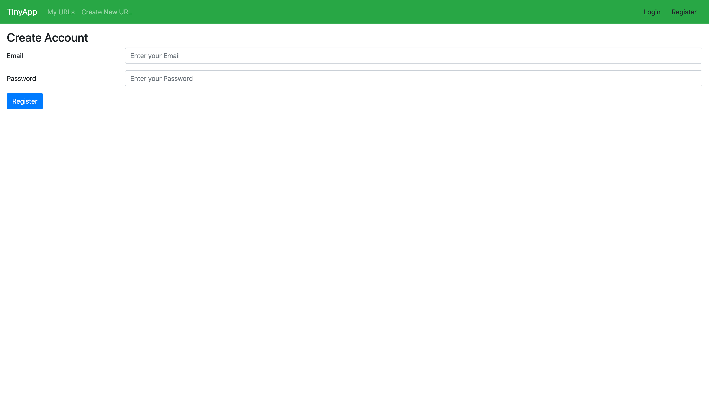
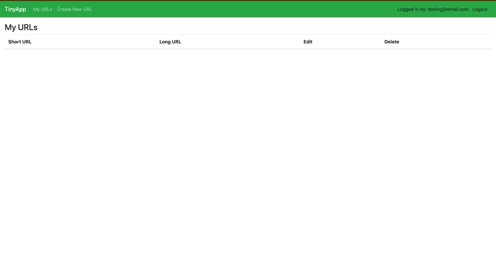
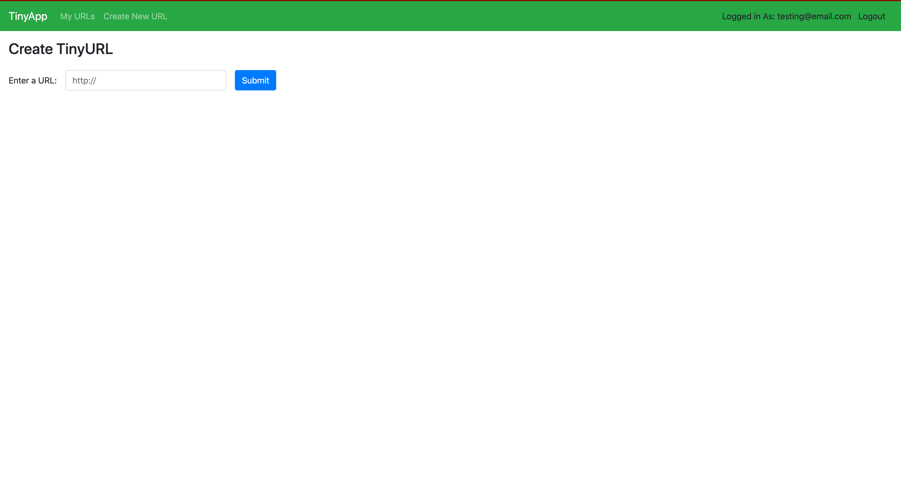
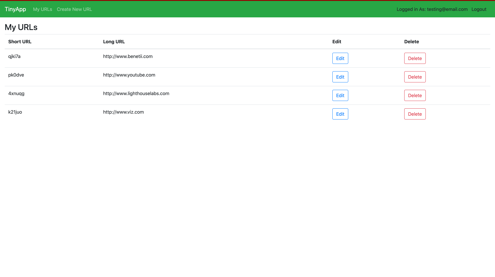

# TinyApp Project

This full stack web application is built with Node and Express and allows users to shorten long URLs (à la bit.ly).

## Final Product

## Dependencies

- Node.js
- bcrypt
- body-parser
- cookie-session
- Express
- EJS

## Getting Started

- Install all dependencies using `npm install` command.
- Run the development web server using the `node express_server.js` command. OR...
- For development purposes ONLY I suggest installing nodemon and starting the server with npm start instead
